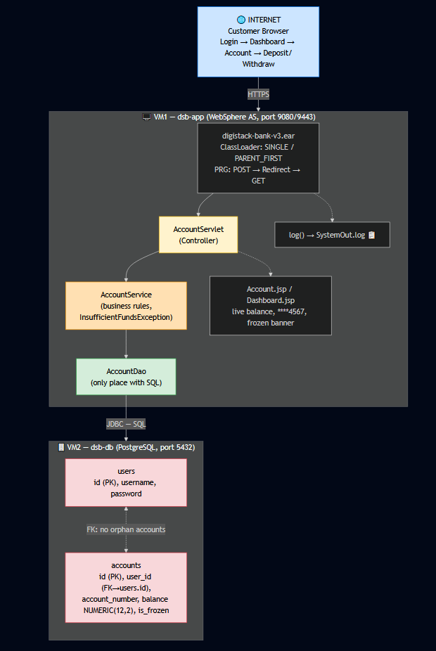

   # What we Achieve From these Version-3
  ### A user logs in, sees their live account on the Dashboard, deposits or withdraws money

  ## Request Flow




   ## Layer-by-Layer Request Flow


```

        BROWSER
           │
           ▼
┌─────────────────────────────┐
│  AccountServlet (Controller)│  "I received the request.
│  GET → show page            │   No SQL here. No rules here.
│  POST → do transaction      │   I just pass things along."
└──────────────┬──────────────┘
               ▼
┌─────────────────────────────┐
│  AccountService (Rules)     │  "Is amount positive?
│  Business decisions         │   Is balance enough?
│  Throws InsufficientFunds   │   If bad → throw exception.
│  Exception if overdraft     │   If good → call DAO."
└──────────────┬──────────────┘
               ▼
┌─────────────────────────────┐
│  AccountDao (SQL)           │  "The ONLY place SQL exists.
│  UPDATE accounts SET...     │   I take plain Java in,
│  Returns Account object     │   return Account objects out."
└──────────────┬──────────────┘
               ▼
┌─────────────────────────────┐
│  PostgreSQL (DB)            │  "accounts table updated.
│  digistack_bank on dsb-db   │   Foreign key keeps data valid."
└─────────────────────────────┘

Then the result travels BACK UP:
DB → DAO → Service → Servlet → redirect (PRG) → fresh GET → JSP shows new balance
                                    ↓
                        log() writes to SystemOut.log 📋

```
# DB Side Concepts
## 🧠 Concept 1 — Foreign Key
```
┌──────────────┐         ┌────────────────┐
│    users     │         │    accounts    │
│              │         │                │
│ id (PK) ◄────┼─────────┤ user_id (FK)   │
│ username     │   1 : N │ id (PK)        │
│ password     │  one    │ account_number │
│ email        │  user   │ account_type   │
│ created_at   │  many   │ balance        │
└──────────────┘  accts  │ is_frozen      │
                         │ created_at     │
                         └────────────────┘
One user can have many accounts. One account belongs to exactly one user.
```
Think of it like this:

    You have a users table. Each user has an ID number (like 1, 2, 3).
    You want an accounts table. Each account belongs to one user.

A foreign key is a way of saying: "This account belongs to THIS user."

The accounts table has a column called user_id. This column "points to" the id column in the users table.

# Backend Side Concept

Remember this Chain
```
   Browser
      ↓
User clicks "Withdraw $50"
      ↓
Servlet (Controller) → "I got the request, here's the data"
      ↓
AccountService → "Is $50 valid? Does the account exist? Is balance enough?"
      ↓
AccountDao → "Let me run the SQL to update the balance"
      ↓
PostgreSQL → "Done, balance updated"
```
### 🍽️ The Restaurant Analogy

Imagine a restaurant:

- **Waiter** takes your order →
- **Manager** decides if the order is allowed →
- **Cook** actually makes the food in the kitchen →

**Nobody does someone else's job.** The waiter doesn't cook. The cook doesn't take orders.

Your Java application works the same way.

---

### 📋 The Layers

| Layer | Restaurant Role | What it does |
|---|---|---|
| **Controller (Servlet)** | Waiter | Receives the user's request from the web page, checks the input is okay, passes it to the Service |
| **Service** | Manager | Makes decisions — *"Is there enough balance to withdraw?"* |
| **DAO** | Cook | The only one allowed in the kitchen (database). All SQL lives here |
| **DB (PostgreSQL)** | Kitchen | Where the actual data is stored |
---

## 🥇 The Golden Rules

1. **No SQL in servlets.**
   The waiter never enters the kitchen.

2. **No business logic in DAOs.**
   The cook doesn't decide menu rules — he just cooks what's ordered.

3. **No layer skips another.**
   The Controller never talks to the DAO directly. It must go through the Service.

---

## 🤔 Why Bother With Layers?

| Benefit | Explanation |
|---|---|
| **Easy to fix** 🐛 | If SQL is broken, you know exactly where to look — the DAO. |
| **Easy to change** 🔄 | Want to switch from PostgreSQL to MySQL? Only the DAO changes. Everything else stays the same. |
| **Easy to test** ✅ | You can test business rules in the Service without touching the database. |

---

# 📚 Concept - ClassLoader — Explained Simply

## What is a ClassLoader?

When Java runs your program, it doesn't magically know your classes. Someone must **pick up** the `.class` files and bring them into memory first.

**That someone is the ClassLoader.**

### 📖 Simple Analogy: The Librarian

> Think of the ClassLoader as a **librarian**.
>
> Your code shouts: *"I need the `Account` class!"*
> The librarian walks to the shelf, finds the file, and hands it over.
>
> **No librarian = no class = error.**

---

## 👨‍👩‍👦 The Hierarchy — A Family of Librarians

WebSphere doesn't have one librarian. It has a **chain** of them, like a company:

    WAS ClassLoader (The Big Boss 👔)
    └── Loads WebSphere's own classes + anything in lib/ext/

    Application ClassLoader (Manager 💼)
    └── Loads your EAR's classes (JARs in the EAR)

    Module ClassLoader (Employee 🧑‍💼)
    └── Loads your WAR's classes (servlets, DAOs, JSPs)


---

## Why Does the Hierarchy Matter?

### One Simple Rule:

> **A parent (boss) cannot see what a child (employee) has.**
> **A child CAN see the parent's stuff.**

| Direction | Allowed? | Meaning |
|---|---|---|
| Child → Parent | ✅ Yes | Your WAR classes can use WAS classes |
| Parent → Child | ❌ No | WAS classes cannot see your WAR classes |

> Like real life: the employee can use the boss's printer. But the boss never at the employee's desk. 🪑

---

## 💥 When It Goes Wrong

Imagine a boss-level class tries to use one of your classes. The librarian searches all the **parent shelves**... doesn't find it... and throws:

ClassNotFoundException


**Even though your class exists!** It's just sitting on a shelf the parent librarian isn't allowed to look at. 😵

This is one of the most confusing WebSphere errors — and now you know exactly why it happens.

---

## ⚙️ The Two Settings You Configure

### Setting 1: WAR Class Loader Policy 🏢

**The question:** *"If my EAR had many WARs — do they share one librarian, or does each get their own?"*

| Option | Simple words |
|---|---|
| **SINGLE** | One librarian serves all WARs — they can see each other's classes 🤝 |
| **MULTIPLE** | Each WAR gets a private librarian — isolated from each other 🔒 |

### Setting 2: Class Loader Order 📖

**The question:** *"When BOTH WAS and your app have the same class — who wins?"*

| Option | Simple words | When to use |
|---|---|---|
| **PARENT_FIRST** (default) | Ask the senior librarian first | Standard, safe choice ✅ |
| **PARENT_LAST** | Ask the junior (your app) first | When your app has a newer library than WAS |

### The Analogy

> Two librarians own the same book.
> **PARENT_FIRST** = always ask the senior one first.
> **PARENT_LAST** = ask the junior first — because theirs is the **newer edition**. 📕


**Real example:** Your app bundles log4j 2.20, but WAS ships log4j 1.0. You want **yours** — so use PARENT_LAST.

---

# 🚨 Very Big Problem HERE
For Example User Do these Transactions
```
2:15 PM  | Teller #07 | Deposit $100 | Acct ••••7008 | ✅
2:22 PM  | Teller #07 | Withdraw $50 | Acct ••••7008 | ✅
2:30 PM  | Teller #07 | Withdraw $9999 | Acct ••••7008 | ❌ DENIED - insufficient funds
─────────────────────────────────────────────────
```
## Customer raise a Complaint
Scenario: A customer complaint 😠

    Customer: "I deposited $100 this morning. Your stupid app ate my money!"

Without the journal, the bank has to argue: "No, you didn't deposit anything." → Customer: "Yes, I did!" → Endless fight. No proof either way. 😖

So We need to Maintain the Journal, Maintain Each and Every Transaction

#### Your "SystemOut.log" IS that journal:

## To achieve these we use "The log() Method" in the UI

```
// This Java code runs on the SERVER — the user never sees it
log("Deposit of 100 processed for account 7");
```
Where does the message go?
```
Your server (dsb-app)
   └── some folder on the server's disk
         └── SystemOut.log   ← written HERE, on the server
```
This is the Full Flow
```
🎨 UI (browser)                    🖥️ BACKEND (server)
─────────────────                  ─────────────────────
User clicks "Deposit $100"
            │
            ├── request sent ──►   AccountServlet receives it
                                   AccountService checks:
                                     - amount positive? ✅
                                     - frozen? ✅ no
                                     - enough balance? ✅
                                   AccountDao runs SQL
                                   PostgreSQL updates balance
                                   log() writes to SystemOut.log 📋
            │                          │
            ◄──── redirect ────────────┘
            │
JSP shows:
"$700.00 ✅ Deposit successful"
(the UI is just a DISPLAY of
 what the backend decided)
```
Now we have Everyting in the Journal "SystemOut.log " ==> based on Customer Request we refer the Log file and Resolve the Isuues
