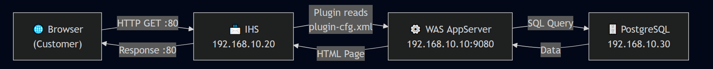
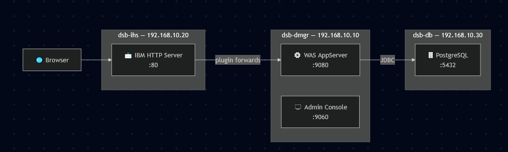

# What we Achieve From these Version-4.5
## Introducing Websphere IHS

  ## Request Flow




   ## VM Request Flow



# What is IBM HTTP Server (IHS)? (Simple idea)

IHS is a **web server** made by IBM. It is basically a smarter version of **Apache** (a very famous free web server).

**Its job:** it sits in front of your **WebSphere (WAS)** server and takes requests from users first.

---

## The Postman Analogy 📮

Imagine your users sending letters:

| Part | Role |
|---|---|
| **Browser** | The person writing the letter (request) |
| **IHS** | The front desk / receptionist who receives the letter |
| **WAS AppServer** | The back office that actually does the work |

> The browser **never goes directly** to the back office. Everything goes through the front desk.

---

## How It Works — Step by Step

1. User opens a page in the browser → request goes to **IHS**
2. Inside IHS there's a helper called the **WAS plugin**
3. The plugin checks: *"Which WAS server should handle this URL?"*
4. It forwards the request to the correct **WAS server**

---

## Why This Is Useful

If WAS needs to be shut down for maintenance:

- ❌ **Without IHS** → users see an ugly error: `connection refused`
- ✅ **With IHS** → the front desk a nice *"We're under maintenance"* page

The user experience stays smooth.

---

## Why Two Separate VMs?

| VM | IP Address | What Runs on It |
|---|---|---|
| **dsb-dmgr | 192.168.10.10 | WebSphere ND (the app server side) |
| **dsb-ihs** | 192.168.10.20 | IBM HTTP Server (the web front door) |

**Key rule:** IHS and WAS live on **different machines** — never the same one. They to each other over the network (the plugin sends requests from IHS to WAS).

> This matches how real companies do it — the web server often sits in a **DMZ** (a protected network zone facing the internet), separate from the app servers.

---

## RAM Note (Your Computer)

From now on, you'll often run **3 VMs at the same time**:

| VM | RAM |
|---|---|
| dsb-dmgr | 3 GB |
| dsb-ihs | 1 GB |
| dsb-db | 2 GB |
| **Total** | **6 GB RAM + 5 vCPU** |

Your host computer can handle this (per **SOE01 §1a**), so no worries — just don't add extra VMs on top.

# Request Flow — Browser → IHS → WAS → DB

## The Big Picture

When a customer opens the DigiStack Bank website, the request travels through **4 stops** before coming back with an answer:

```
┌─────────┐      ┌─────────┐      ┌─────────┐      ┌─────────┐
│ Browser │ ───► │   IHS   │ ───► │   WAS   │ ───► │   DB    │
│ Windows │ :80  │  .10.20 │ :9080│  .10.10 │      │  .10.30 │
└─────────┘ ◄─── └─────────┘ ◄─── └─────────┘ ◄─── └─────────┘
```

> The request goes **forward** through all 4 stages, and the response comes **back** the same path in reverse.

---

## Stage-by-Stage Walkthrough

### Stage 1 — Browser (the customer)

1. Customer types `http://192.168.10.20/digistack-bank/Home`
2. The browser sends an **HTTP GET request** over the network
3. Target: port **80** on the IHS VM (192.168.10.20)

> 📌 The browser knows **nothing** about WAS or the database. It only knows the web address.

### Stage 2 — IHS receives the request (the front desk)

1. IHS receives the request on **port 80**
2. The **WAS plugin** (a module loaded inside IHS) reads its routing table: `plugin-cfg.xml`
3. The plugin checks: *"Does `/digistack-bank/*` belong to a WAS application?"*
4. **Yes** → forward the request to WAS at `192.168.10.10:9080`

> 📌 If the URL did **not** match (e.g., a static image), IHS would serve it itself. Here it matches, so it forwards.

### Stage 3 — WAS processes the request (the back office)

1. WAS receives the request on **port 9080**
2. The plugin routing matched `/digistack-bank/Home` → **HomeServlet** runs
3. The servlet needs data (e.g., bank name from `app_config` table)

### Stage 4 — Database (the filing cabinet)

1. WAS connects to **PostgreSQL** on dsb-db (192.168.10.30)
2. Runs a query, e.g.: `SELECT * FROM app_config`
3. PostgreSQL returns the data to WAS

### The Return Journey

1. WAS builds the **HTML page** and sends it back to IHS (port 9080 → IHS)
2. IHS passes the page back to the browser (port 80 → browser)
3. Browser renders the page — customer sees the Home page with **Database: Connected** ✅

---

## Evidence at Each Stage (How to Prove Each Hop)

| Stage | Log / Proof | Command |
|---|---|---|
| 1 → 2: Request hit IHS | IHS `access_log` shows `GET /digistack-bank/Home 200` | `tail /opt/IBM/HTTPServer/logs/access_log` |
| 2: Plugin routing decision | Plugin log shows URI match + routing | `tail /opt/IBM/WebSphere/Plugins/logs/webserver1/http_plugin.log` |
| 3: WAS processed it | `SystemOut.log` shows `HomeServlet: DB read successful` | `grep HomeServlet .../SystemOut.log` |
| 4: DB answered | Green **Database: Connected** banner on the page | Visual check |

---

## Simple Analogy — The Restaurant 🍽️

1. **Browser** = customer walks in and orders from the waiter
2. **IHS** = the **waiter** — takes the order to the kitchen, never lets the customer into the kitchen
3. **WAS plugin** = the waiter's **order slip** telling him which kitchen to send it to
4. **WAS** = the **kitchen** — actually prepares the food
5. **DB** = the **pantry/storeroom** — where the ingredients come from
6. The food comes back: kitchen → waiter → customer

The customer never sees the kitchen or pantry — they only see the waiter. That's the **transparent reverse proxy** pattern.

---

## Key Rules to Remember

- The browser **only ever talks to IHS** (port 80) — never directly to WAS
- `plugin-cfg.xml` is **generated by WAS**, **consumed by IHS**
- If IHS is down → port 80 dead, but WAS still works directly on 9080
- If WAS is down → IHS can still serve a **maintenance page** instead of an error
- From **v8 onward**, port 9080 is firewalled — IHS becomes the **only** way in

